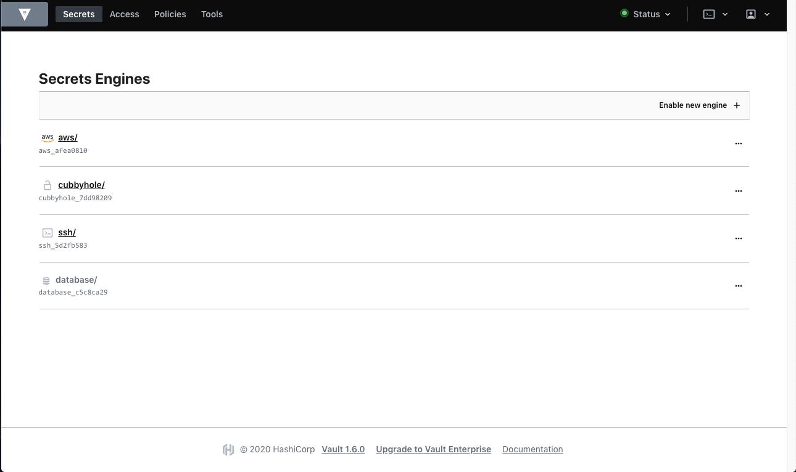

## Vault Secrets Management

### What is Vault

A system that allows you to secure, store and tightly control access to tokens, passwords, certificates, encryption keys for protecting secrets and other sensitive data using a UI, CLI, or HTTP API.

Simply put… password and other sensitive data need to be stored, transmitted, and secured in a way that protect the integrity of the sensitive information while providing mechanisms to rotate or change access to that sensitive data

### Understanding Vault

Please review these videos from Hashicorp to obtain a greater understanding of Vaul and what it can do and common use cases.

https://learn.hashicorp.com/collections/vault/getting-started

### Vault Use Cases

https://www.vaultproject.io/docs/use-cases

### Getting Started with Vault

For the purposes of this lab you will be working with a preconfigured Vault server. However, after installing Vault the process to configure the server contains a few basic steps before you can use it. Vault utilized keys and tokens to control access to the Vault and secrets stored in it. Please reference the following items you need to run in order to prepare your vault environment

### Step 1: Unseal Your Vault 

`vault operator unseal kVurBTTpmIwaXgbhsN98WXxpAdaW2gmCmq1HH9MLoz4=`

### Step 2: Download and securely store your keys and tokens in the event you need to seal your Vault

The keys and token output after you unseal your vault should look something like the following

  "keys": [
    "256cfa22af3c31c9e0b9e364e263837011aae42a20ba9067022b716fb376e8729f",
    "14a2bc43y0744801be583059eac0a106a1d8b0b1cb6c70047a195e0bf1f01bd02z",
    "2f4cc1aee087379adc1db0006bb3ff07724e28ba3cd9x0b75ab646zcdf32b67e49",
    "3fez21ac2ca324bfc0ef6c3a61b30e3b74fc11411f6e10948f8a44b7fcf6275yc0",
    "66681859c25241e7785bf4c30f231a07y8ey9c4dcd3efd6ecfb7d101fa5386e8b4"
  ],
  "keys_base64": [
    "UKz6Iq88McngueNk5SaDcBGq5CogupBnFEtxb7N13USf",
    "BBB4Q7B0SAG+WDBZ6sCiBqHYsLHLyHAEejheC/HwG9Zq",
    "L4zBruCHN5rcHbZZa7P/B3EuKLor84r2brZGrN9itn5J",
    "S-ohrCyjJL/Z72w6YbMOO3T4IUIfbhCUj4qIt/z2J1vA",
    "W2gYMcJSQed4W/jPPyMaB7jrnE3NPv1uz7fRZfpThui9"
  ],
  "root_token": "s.kvidX6uiqXRGQrFk2JdsI0xB"
}

### Step 3: Run this command on the command line to allow you to access the Vault instance using the root token. Typically you would not use the root token to access vault and you would usually generate a new token for access but for the purposes of this lab this is the fastest way to get you up an running using Vault.

`export VAULT_TOKEN=s.kvidX6uiqXRGQrFk2JdsI0xB`

### Step 4: Run the following command to verify your vault instance is running properly

`curl -X GET -H "X-Vault-Token:s.kfluX3uiqXRgQRFk2JdsI9XS" http://3.101.119.212:8200/v1/sys/seal-status`

### Here are some Vault commands that allow you to read, write, and enable features you will need

`vault write -address="http://3.101.119.212:8200" cubbyhole/creds/erik D0ntSh@reP@ssw0rd5`

`vault read -address="http://3.101.119.212:8200" cubbyhole/creds`

`vault write -address="http://3.101.119.212:8200" cubbyhole/creds key=erik value=rwhJYAqcT7TwfdDT`

`vault list -address="http://3.101.119.212:8200"`

`vault kv put -address="http://3.101.119.212:8200" cubbyhole/creds foo=world`

`vault namespace list -address="http://3.101.119.212:8200"`

`vault secrets enable -address="http://3.101.119.212:8200" aws`

`vault secrets enable -address="http://3.101.119.212:8200" ssh`

`vault secrets enable -address="http://3.101.119.212:8200" -max-lease-ttl=30m database`
